# Maven Dependency Visualizer
**Maven Dependency Visualizer** — это инструмент для визуализации зависимостей Maven-пакетов в формате диаграммы Mermaid. Программа позволяет анализировать как прямые, так и транзитивные зависимости пакетов, получая их информацию из центрального Maven-репозитория.

## Установка

### Требования
- Python 3.6+
- Библиотеки:
  - requests (для загрузки POM-файлов)

Установите необходимые зависимости через pip:
```bash
pip install requests
```

## Использование

### Запуск
Для использования утилиты необходимо указать пакет Maven в формате `groupId:artifactId:version`, а также путь к файлу, в который будет сохранен результат.

Пример запуска:
```bash
python maven_visualizer.py --package-name com.example:my-library:1.0.0 --output-path output.md
```

### Аргументы
`--package-name` (обязательный): Имя пакета в формате `groupId:artifactId:version`.
Пример: `org.apache.commons:commons-lang3:3.12.0`.

`--output-path` (обязательный): Путь к файлу, в который будет сохранен результат.
Пример: `output.md`.

`--repo-url `(необязательный): URL Maven-репозитория для загрузки транзитивных зависимостей. По умолчанию используется https://repo1.maven.org/maven2.

Пример с указанием альтернативного репозитория:

```bash
python maven_visualizer.py --package-name com.example:my-library:1.0.0 --output-path output.md --repo-url https://custom.maven.repo
```

### Пример вывода
В результате работы программы генерируется код для визуализации зависимостей в формате Mermaid:

```mermaid
%%{init: {'theme': 'base', 'themeVariables': {}, 'flowchart': {'rankSpacing': 250, 'nodeSpacing': 100}} }%%
graph TD;
    junit:4.13 --> junit-bom:5.7.1;
    junit:4.13 --> junit-jupiter:5.7.1;
    junit:4.13 --> junit-jupiter-api:5.7.1;
    junit:4.13 --> junit-jupiter-engine:5.7.1;
    junit:4.13 --> junit-jupiter-migrationsupport:5.7.1;
    junit:4.13 --> junit-jupiter-params:5.7.1;
    junit:4.13 --> junit-platform-commons:1.7.1;
    junit:4.13 --> junit-platform-console:1.7.1;
    junit:4.13 --> junit-platform-engine:1.7.1;
    junit:4.13 --> junit-platform-jfr:1.7.1;
    junit:4.13 --> junit-platform-launcher:1.7.1;
    junit:4.13 --> junit-platform-reporting:1.7.1;
    junit:4.13 --> junit-platform-runner:1.7.1;
    junit:4.13 --> junit-platform-suite-api:1.7.1;
    junit:4.13 --> junit-platform-testkit:1.7.1;
    junit:4.13 --> junit-vintage-engine:5.7.1;
    junit-pioneer:1.3.0 --> junit-bom:5.5.2;
    easymock:4.2 --> surefire-junit-platform:3.0.0-M4;
    easymock:4.2 --> objenesis:3.1;
    easymock:4.2 --> dexmaker:1.5;
    easymock:4.2 --> junit-jupiter:5.6.0;
    easymock:4.2 --> junit-vintage-engine:5.6.0;
    easymock:4.2 --> junit:4.13;
    easymock:4.2 --> testng:7.1.0;
    openjdk.jmh --> jmh-core:1.27;
    openjdk.jmh --> jmh-generator-annprocess:1.27;
    google.code.findbugs --> jsr305:3.0.2;
    puppycrawl.tools --> checkstyle:8.40;
    puppycrawl.tools --> archunit-junit5:0.15.0;
    puppycrawl.tools --> picocli:4.6.1;
    puppycrawl.tools --> antlr:2.7.7;
    puppycrawl.tools --> antlr4-runtime:4.9.1;
    puppycrawl.tools --> commons-beanutils:1.9.4;
    puppycrawl.tools --> guava:30.0-jre;
    puppycrawl.tools --> ant:1.10.9;
    puppycrawl.tools --> reflections:0.9.12;
    puppycrawl.tools --> junit-jupiter-api:5.7.0;
    puppycrawl.tools --> junit-jupiter-engine:5.7.0;
    puppycrawl.tools --> junit5-system-extensions:1.1.0;
    puppycrawl.tools --> junit-vintage-engine:5.7.0;
    puppycrawl.tools --> truth:1.1.2;
    puppycrawl.tools --> system-rules:1.19.0;
    puppycrawl.tools --> equalsverifier:3.5.2;
    puppycrawl.tools --> powermock-api-mockito2:2.0.9;
    puppycrawl.tools --> powermock-module-junit4:2.0.9;
    puppycrawl.tools --> commons-io:2.8.0;
    puppycrawl.tools --> org.eclipse.jgit:5.10.0.202012080955-r;
    puppycrawl.tools --> slf4j-simple:1.7.30;
    puppycrawl.tools --> org.jacoco.agent:0.8.6;
    puppycrawl.tools --> Saxon-HE:10.3;
    puppycrawl.tools --> pitest-junit5-plugin:0.12;
    puppycrawl.tools --> pmd-java:6.30.0;
    puppycrawl.tools --> pmd-core:6.30.0;
    puppycrawl.tools --> pmd-javascript:6.30.0;
    puppycrawl.tools --> pmd-jsp:6.30.0;
    puppycrawl.tools --> sevntu-checks:1.38.0;
    puppycrawl.tools --> checkstyle:8.29;
    puppycrawl.tools --> ant-nodeps:1.8.1;
    puppycrawl.tools --> org.eclipse.jdt.annotation:2.2.600;
    github.spotbugs --> spotbugs:4.2.1;
    github.spotbugs --> asm:9.0;
    github.spotbugs --> asm-analysis:9.0;
    github.spotbugs --> asm-commons:9.0;
    github.spotbugs --> asm-tree:9.0;
    github.spotbugs --> asm-util:9.0;
    github.spotbugs --> bcel:6.5.0;
    github.spotbugs --> jcip-annotations:1.0;
    github.spotbugs --> dom4j:2.1.3;
    github.spotbugs --> commons-lang3:3.11;
    github.spotbugs --> commons-text:1.9;
    github.spotbugs --> slf4j-api:1.8.0-beta4;
    github.spotbugs --> spotbugs-annotations:4.2.1;
    github.spotbugs --> json:20201115;
    github.spotbugs --> jaxen:1.2.0;
    biz.aQute.bnd --> biz.aQute.bndlib:5.3.0;
    biz.aQute.bnd --> osgi.annotation:8.0.0;
    biz.aQute.bnd --> osgi.core:6.0.0;
    biz.aQute.bnd --> org.osgi.namespace.contract:1.0.0;
    biz.aQute.bnd --> org.osgi.namespace.extender:1.0.1;
    biz.aQute.bnd --> org.osgi.namespace.implementation:1.0.0;
    biz.aQute.bnd --> org.osgi.namespace.service:1.0.0;
    biz.aQute.bnd --> org.osgi.service.log:1.3.0;
    biz.aQute.bnd --> org.osgi.service.repository:1.1.0;
    biz.aQute.bnd --> org.osgi.util.function:1.1.0;
    biz.aQute.bnd --> org.osgi.util.promise:1.1.1;
    biz.aQute.bnd --> slf4j-api:1.7.25;
```

Диаграмма может быть визуализирована с помощью Mermaid Live Editor или включена в документацию, поддерживающую Mermaid.

Можно визуализировать командой
```bash
mmdc -i output.mermaid -o diagram.svg 
```

### Ошибки
Если пакет не может быть загружен или не существует, программа выведет соответствующее сообщение:
```bash
Ошибка загрузки файла pom.xml с URL: https://repo.maven.org/...
```